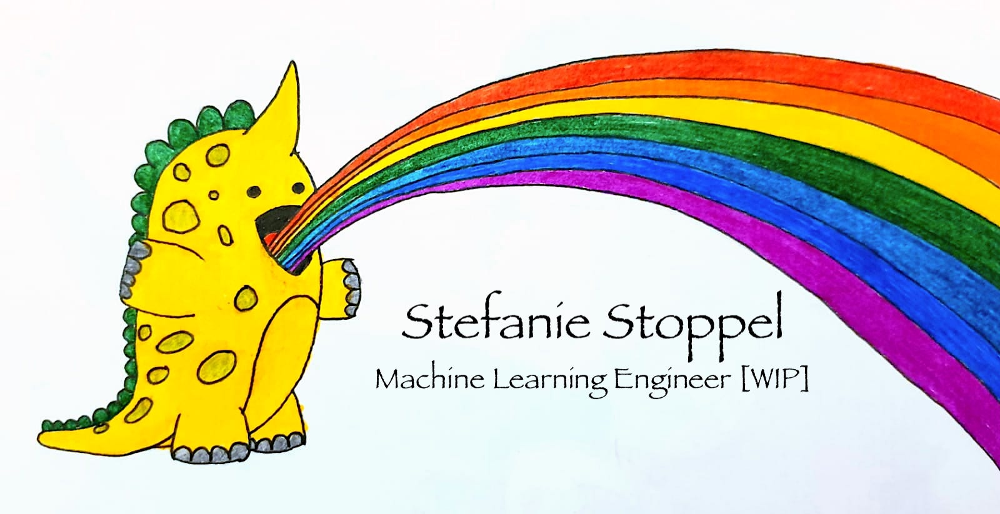

<!--
**StefanieStoppel/StefanieStoppel** is a ✨ _special_ ✨ repository because its `README.md` (this file) appears on your GitHub profile.

Here are some ideas to get you started:

- 🔭 I’m currently working on ...
- 🌱 I’m currently learning ...
- 👯 I’m looking to collaborate on ...
- 🤔 I’m looking for help with ...
- 💬 Ask me about ...
- 📫 How to reach me: ...
  - 😄 Pronouns: ...
  - ⚡ Fun fact: ...
  -->

### Hellooooo 👋
My name is Steffi (she/her) and I'm a Software Developer turning Machine Learning Engineer. I'm passionate about learning more about ethical AI, how algorithms impact our societies and how we can use them to build a more equitable future.

--- 

### Find me...
- ... on [Medium](https://medium.com/@qbrid) writing blog posts about Machine Learning, Python and improving my development workflows.
- ... on [Twitter](https://twitter.com/Qbrid_) mostly posting about fairness in AI & the occasional rant on the state of scientific repositories 😉
- ... offline, as I also like to spend a considerable amount of my days not staring at a screen 🙈
